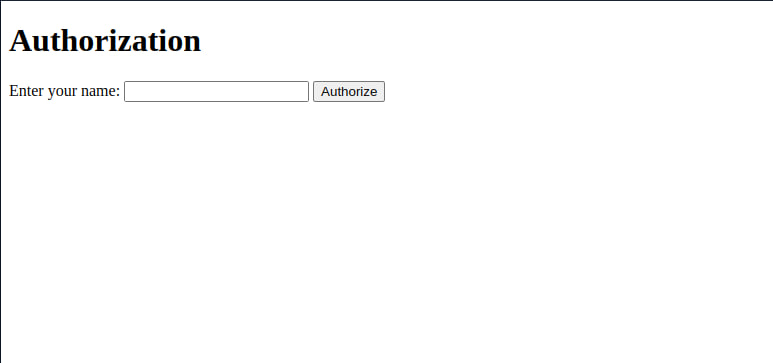
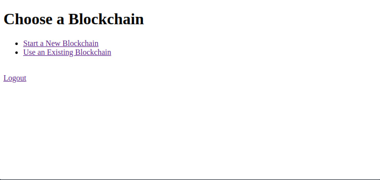
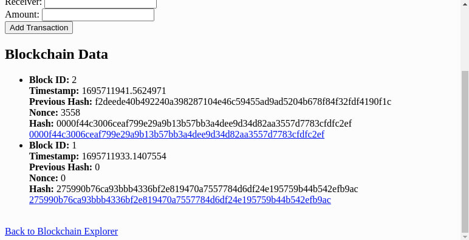
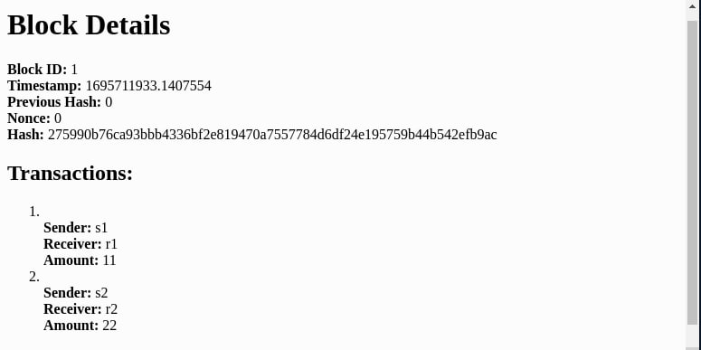

# Solution to 3rd Homework

## Task 1

Solution for 1st task presented in file 'task1.py'. 
There is developed function:
```python
def computeNED(p : int, q : int) -> tuple[int, int, int]:
    """
    Function for computing RSA numbers 

    Arguments:
    p, q - prime numbers

    Returns:
    n, e, d integer values for encyption / decryption
    """
    ...
```

## Task 2

Solution for 2nd task presented in file 'task2.py'.
There is developed function for text decryption / encryption:
```python
def encrypt_decrypt(e_d : int, n : int, text: str) -> str:
    """
    Function for encryption and decryption of given text

    Arguments:
    e_d  - RSA values, pass 'e' to encrypt, 'd' to decrypt
    text - string  
    """
    ...
```

Also here function for encryption and computing RSA values:
```python
def apply_rsa(p : int, q : int, text_to_encrypt : str) -> tuple[int, int, int, str]:
    """
    Function for compting RSA values and encrypting string

    Arguments:
    p, q            - prime numbers, throw exception if not prime
    text_to_encrypt - text that should be encrypted

    Return:
    n, e, d - RSA values
    str - encrypted string  
    """
    ...
```


## Task 3
Solution for 3rd task presented at the [link](https://replit.com/@CyberTDan/BlockchainFlask-1)

<br>

### Usage:
### 3.1

To start one can launch 'main.py' file.

At the begining, program requres to write user name.



This mechanizm used to distinguish users.

### 3.2

Then user can choose: create new block chain or open existing one



### 3.3

Blockhain page shows list of blocks.



### 3.4 

To open block info one can click on block hash link



<br>

### Encryption mechanizm

For each user generated new 'n, e, d' RSA values:

```python
@app.route('/', methods=['GET', 'POST'])
def authorize():
  if request.method == 'POST':
    name = request.form['name']

    # Check if user alredy exists in database
    values = database.get_user_values(name)
    if values:
      session['n'] = int(values[0])
      session['e'] = int(values[1])
      session['d'] = int(values[2])
    else:
      #  If not, generate new values
      p, q = choose_prime_pair()
      n, e, d = computeNED(p, q)
      database.add_user(name, n, e, d)
      session['n'] = n
      session['e'] = e
      session['d'] = d
    return redirect(url_for('index'))

  return render_template('authorize.html')
```

RSA values saved in session data

<br>

Encryption and decryption process happen on reading and writing to database:

```python
# method for saving transaction
@app.route('/add_transaction/<string:id>', methods=['POST'])
def add_transaction(id):
  sender = encrypt_decrypt(session.get('e'), session.get('n'),
                           request.form['sender'])
  receiver = encrypt_decrypt(session.get('e'), session.get('n'),
                             request.form['receiver'])
  amount = encrypt_decrypt(session.get('e'), session.get('n'),
                           request.form['amount'])
  ...
```

```python
# method for retrieving block data
@app.route('/block/<string:id>/<string:hash>')
def get_block_by_hash(id, hash):
  block = database.read_block(id, hash)
  transactions = [list(item) for item in database.read_transaction(id, hash)]

  # decode transaction data
  for row, transaction in enumerate(transactions):
    for col, data in enumerate(transaction):
      transactions[row][col] = encrypt_decrypt(session.get('d'),
                                               session.get('n'), data)
  ...
```