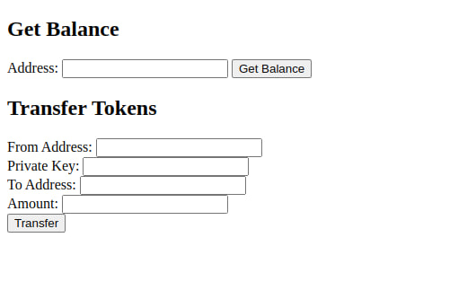
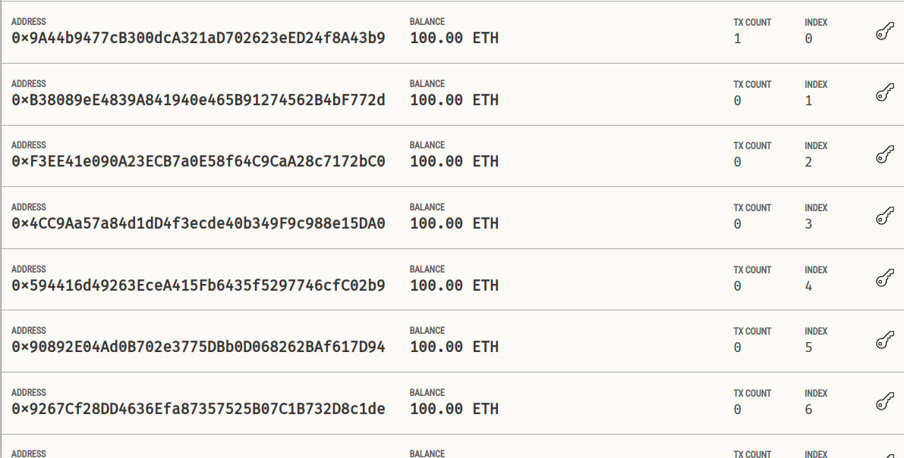
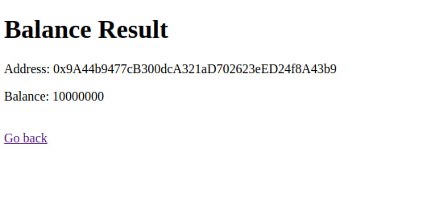
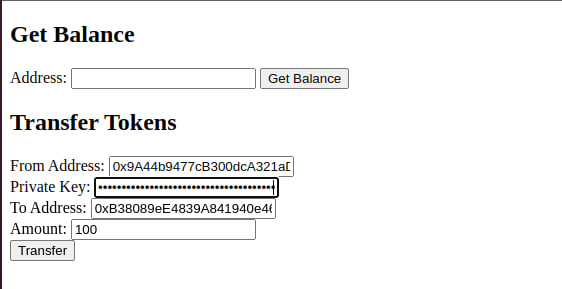
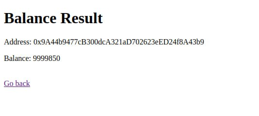
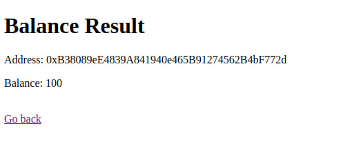
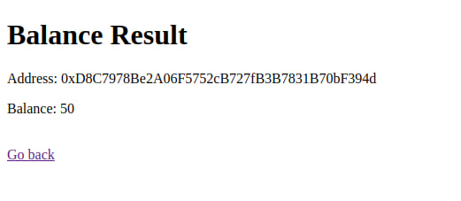

# ERC20 Token Exercise

## Contract code 

can be found in 'token.sol' file

 

## Application 

Application code placed in 'app' folder. This application implement simple html page for transfering and checking balance

 

## Execution

Application was launched using 'Ganache' and 'Remix'. One can open it on http://127.0.0.1:500

 

Enterance page:

 

Ganache created users:

First user is contract owner

 

Initial coin balance:

 

Transfer from first to second user 100 coins:

 

Contract owner balance reduced on 100+50 coins:

 

Receiver user balance become 100:

 

Professor balance increased on 50 coins:

